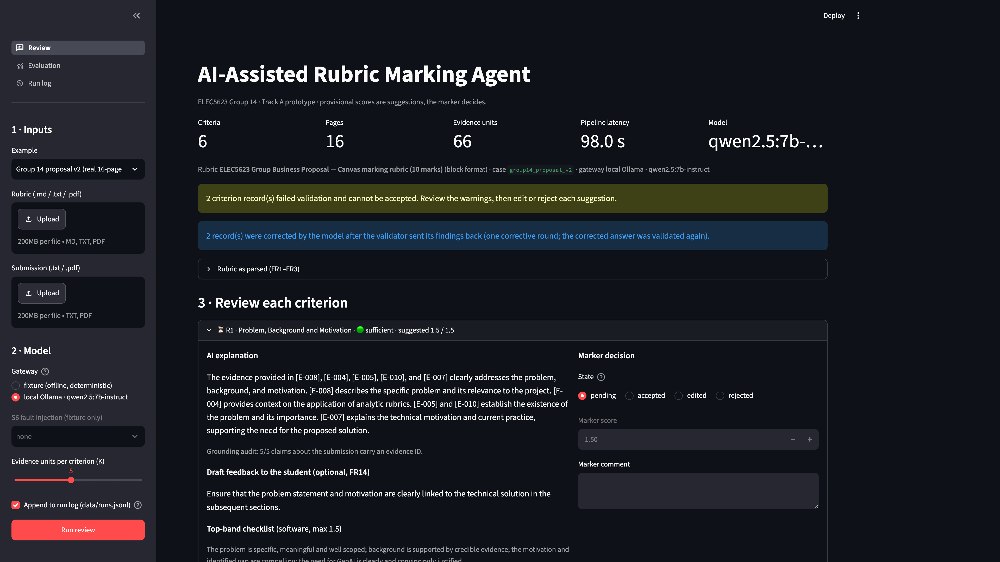
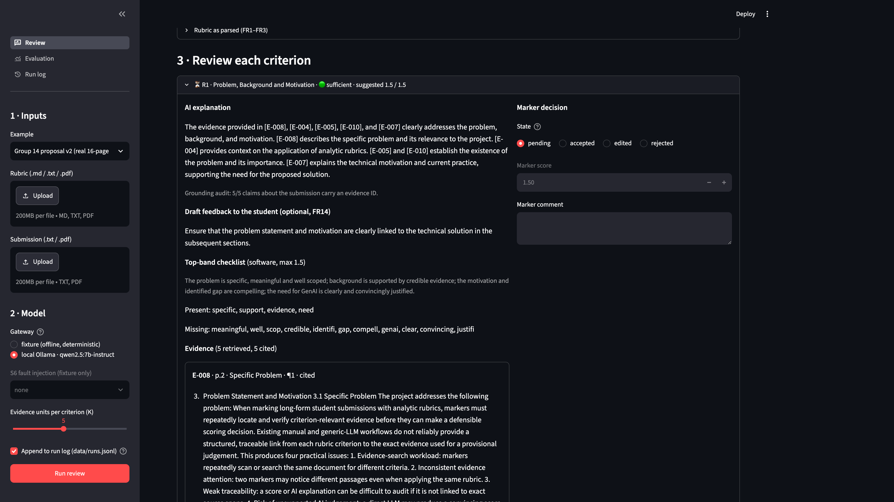

# AI-Assisted Rubric Marking Agent

ELEC5623 Group 14 · Track A · semester project prototype (v1.0.0, frozen 7 Oct 2026).

A decision-support tool for human markers: it parses an analytic rubric and a
long text submission, retrieves evidence per criterion, asks a model for an
**evidence-constrained** provisional score, validates the answer (and sends the
validator's findings back to the model once if it broke a rule), and lets the
marker accept, edit or reject each criterion before anything is exported. It
is not an autonomous grader (Constraint C1).



*Review page on the real case with the local 7B model, 7 October 2026: 16 pages
become 66 evidence units, six criteria complete in 98 s, two records were
repaired after the validator fed its findings back, and two are held as failing
validation and cannot be accepted. The grounding audit reads 5/5 claims
carrying an evidence id. Every score is `pending` until the marker decides.*



*The same criterion, scrolled to the evidence: five units retrieved, five
cited, each with its page and section, shown next to the explanation that cites
it (FR7).*

```
rubric + submission → parse → chunk (E-001…) → BM25 top-K per criterion
        → model gateway (criterion + evidence only) → validator (fail-closed, 1 corrective round)
        → marker review (accept / edit / reject) → export JSON/CSV + run log → replay
```

## Quick start

```bash
cd rubric-marking-agent
python3 -m venv .venv && source .venv/bin/activate
pip install -e '.[dev]'
python scripts/generate_dataset.py        # regenerates synthetic inputs; preserve manual edits first
pytest -q                                 # offline regression tests
ruff check src tests app scripts          # lint (also in CI)
rma demo --submission s4_decoy_eval       # agent path on the keyword-decoy case
rma baseline --submission s4_decoy_eval   # B2: whole-document grading, for contrast
rma eval --report docs/EVALUATION.md      # M1–M17 harness on 62 labelled pairs
rma demo --log runs.jsonl && rma replay --log runs.jsonl   # M12 reproducibility
streamlit run app/streamlit_app.py        # marker UI + Evaluation + Run log pages
python scripts/export_second_pass.py      # blank 62-row sheet; do not copy the first labels
```

### The real case

The first example in the UI (and the command below) runs the agent over **our
own 16-page proposal PDF against the official Canvas marking rubric** (six
criteria, 10 marks, level descriptors verbatim). It is the only real document
in the repository; we own it and the cover page with names and IDs is removed.
See `dataset/real/README.md`.

```bash
rma demo --rubric dataset/real/elec5623_business_proposal_rubric.md \
         --submission dataset/real/group14_proposal_v2.pdf
```

### Models

| Gateway | How to select | Use |
|---|---|---|
| **fixture** (default) | `--gateway fixture` before the subcommand | deterministic offline stand-in; tests, CI, fault injection |
| **local Ollama** | run `ollama serve`, then `rma --gateway ollama:qwen2.5:7b-instruct demo` (the UI lists running models automatically) | real model, no key, nothing leaves the machine — this is candidate (b) of proposal §6.3 |
| **hosted / Azure** | `RMA_MODEL_ENDPOINT`, `RMA_MODEL`, `RMA_MODEL_API_KEY` (+ `RMA_API_KEY_HEADER=api-key`, `RMA_API_VERSION` for Azure), then `rma --gateway live demo` | candidate (a); see `docs/GOVERNANCE.md` for secret handling |

Live evaluation with the local model: `rma --gateway ollama:qwen2.5:7b-instruct eval --repeats 2 --report docs/EVALUATION_live_qwen7b.md --json docs/evaluation_live_qwen7b.json`
(about 50 min on an M2 Pro; results committed under `docs/`).

## What is in the box

| Path | Purpose |
|---|---|
| `src/rubric_agent/` | Package: parsers, chunker, retriever, gateway, validator, review, store, eval, CLI |
| `app/streamlit_app.py`, `app/review.py`, `app/evaluation.py`, `app/run_log.py` | Marker UI (review · B2 comparison · export), Evaluation dashboard, Run-log viewer with replay |
| `prompts/` | Versioned prompts (`assessment_v4` current, `v1`–`v3` and `v5` kept so `docs/tuning/` can be re-run, `direct_grading_v1` for B2) |
| `dataset/` | 3 synthetic rubrics (block, table, numbered), 13 submissions, 62 labelled pairs, labelling guide |
| `dataset/real/` | Official Canvas rubric (transcribed) + our proposal PDF |
| `tests/` | Acceptance tests mapped to FR/NFR IDs and scenarios S1–S8, plus headless UI tests |
| `docs/ARCHITECTURE.md` | Context and container diagrams, module table, failure handling |
| `docs/REQUIREMENTS_TRACEABILITY.md` | FR/NFR → code → test → metric → owner |
| `docs/EVALUATION.md`, `docs/EVALUATION_live_qwen7b.md` | Generated metric reports: fixture and local 7B model |
| `docs/EVALUATION_NOTES.md` | What the numbers mean: agent vs B2, the label/sufficiency finding, k=10 control run, latency |
| `docs/GOVERNANCE.md` | Oversight, privacy, secrets, limitations, risk register status |
| `docs/DEMO_SCRIPT.md` | Week 13 demo run-sheet and Q&A prep |
| `CONTRIBUTING.md` | Branch/PR rules and area ownership A1–A5 |
| `STATUS.md` | What is done, what needs people, what needs the tutor |
| `AI_USE.md` | Generative AI disclosure |

## Current development and assessment alignment (4 October 2026)

The proposal scored **6.5/10**, per feedback supplied by the user. The final
project retains the same Track A problem; evidence-first scoring is established
prior work, not an invention claimed here. Start with:

- `docs/MARKER_RESPONSE.md`: each deduction mapped to a concrete response.
- `docs/RELATED_WORK.md`: Evidence-First Scoring, GradeAgentOps, RULERS and RAG comparison with verified primary sources.
- `docs/EVALUATION_PROTOCOL.md`: fixed model/configuration, A/B2/B3 controls, metric definitions and independent-study plan.
- `docs/TEAM_DELIVERY.md`: named proposed ownership; **Zhengyu Han leads the core GenAI system and evaluation**.
- `docs/FINAL_REPORT_DRAFT.md`: the ten-section working report; contribution evidence and human studies remain incomplete.
- `docs/validation/README.md`: current-source checks, separate from the historical model-quality reports.

B3 changes only context selection/order while retaining the criterion prompt,
citations, validation and revision budget:

```bash
rma --gateway fixture demo --submission s4_decoy_eval --evidence-mode full_context
rma --gateway fixture eval --evidence-mode full_context --no-baseline --report docs/EVALUATION_B3_fixture_v2.md --json docs/evaluation_B3_fixture_v2.json
```

Review now refuses direct acceptance of an invalid or absent AI score. Manual
scores must obey the rubric range and step. Invalid edits block export. Model
values must be finite; quoted feedback cannot bypass the evidence checks.

**Evidence limits:** M6 counts uncited positive sentences, not semantic
hallucinations. MAE/QWK exclude abstentions and must be read with score coverage.
Historical pooled QWK is not comparable with the revised within-criterion
metric. Fixture results demonstrate software behaviour only. Independent labels,
user timings and a full current-model campaign are still needed.

The local `ELEC5623_A2.pdf` specifies source code plus one final report (suggested
8–12 pages excluding references/appendices), due 3 November 2026 at 23:59;
presentation/Q&A is 4 November. Dates are from the saved brief, not a fresh
Canvas check. Live presentation/Q&A prohibits AI. The older Week 8 notes are
historical course material.
