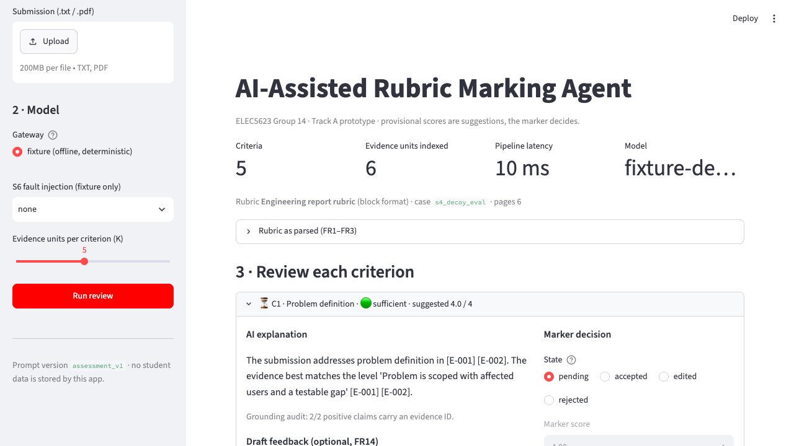

# AI-Assisted Rubric Marking Agent

ELEC5623 Group 14 · Track A · semester project prototype.

A decision-support tool for human markers: it parses an analytic rubric and a
long text submission, retrieves evidence per criterion, asks a model for an
**evidence-constrained** provisional score, validates the answer, and lets the
marker accept, edit or reject each criterion before anything is exported. It is
not an autonomous grader (Constraint C1).



```
rubric + submission → parse → chunk (E-001…) → BM25 top-K per criterion
        → model gateway (criterion + evidence only) → validator (fail-closed)
        → marker review (accept / edit / reject) → export JSON/CSV + run log
```

## Quick start

```bash
cd rubric-marking-agent
python3 -m venv .venv && source .venv/bin/activate
pip install -e '.[dev]'
python scripts/generate_dataset.py        # synthetic corpus, safe to re-run
pytest -q                                 # 28 tests, offline, ~20 s
rma demo --submission s4_decoy_eval       # agent path on the keyword-decoy case
rma baseline --submission s4_decoy_eval   # B2: whole-document grading, for contrast
rma eval --report docs/EVALUATION.md      # M1–M17 harness on 62 labelled pairs
rma demo --log runs.jsonl && rma replay --log runs.jsonl   # M12 reproducibility
streamlit run app/streamlit_app.py        # marker UI
```

Default model is the **fixture**: a deterministic, offline stand-in that lets
tests, CI and the demo run with no key and no student data. To use a real
model, set the `RMA_*` variables described in `docs/GOVERNANCE.md` and pass
`--gateway live` (or pick "live" in the UI). Nothing else changes.

## What is in the box

| Path | Purpose |
|---|---|
| `src/rubric_agent/` | Package: parsers, chunker, retriever, gateway, validator, review, store, eval, CLI |
| `app/streamlit_app.py` | Marker UI (no prompt writing; export gated on decisions) |
| `prompts/` | Versioned prompts (`assessment_v1`, `direct_grading_v1`) |
| `dataset/` | 3 synthetic rubrics (block, table, numbered), 13 submissions, 62 labelled pairs, labelling guide |
| `tests/` | Acceptance tests mapped to FR/NFR IDs and scenarios S1–S8 |
| `docs/ARCHITECTURE.md` | Context and container diagrams, module table, failure handling |
| `docs/REQUIREMENTS_TRACEABILITY.md` | FR/NFR → code → test → metric → owner |
| `docs/EVALUATION.md` | Generated metric report (fixture; re-generate with a live model) |
| `docs/GOVERNANCE.md` | Oversight, privacy, secrets, limitations, risk register status |
| `docs/DEMO_SCRIPT.md` | Week 13 demo run-sheet and Q&A prep |
| `CONTRIBUTING.md` | Branch/PR rules and area ownership A1–A5 |
| `STATUS.md` | What is done, what needs people, what needs the tutor |
| `AI_USE.md` | Generative AI disclosure |

## Status against the course

Checked Canvas 13 Sep 2026: the Project Development (20%) and Presentation
(10%) briefs are still not published as assignment pages; Week 1 slides list
the expected evidence (working prototype aligned with the approved proposal,
repository history, architecture, evaluation, safety/governance, limitations,
contribution record, Week 13 demo with all-member Q&A). This repository targets
that list. See `STATUS.md` for the open items that need people or approvals
rather than code.

Also from Canvas: **Lab 6 (published 13 Sep) confirms the mid-term quiz on
Wed 16 Sep, 11:00, paper, 1 hour, Weeks 1–6, one A4 double-sided cheat sheet,
calculator allowed.** This repository does not help with that.
