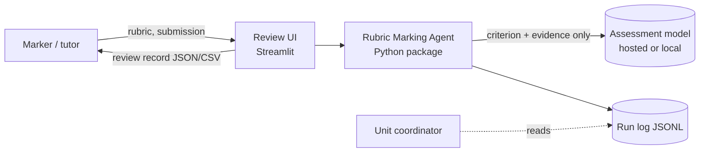
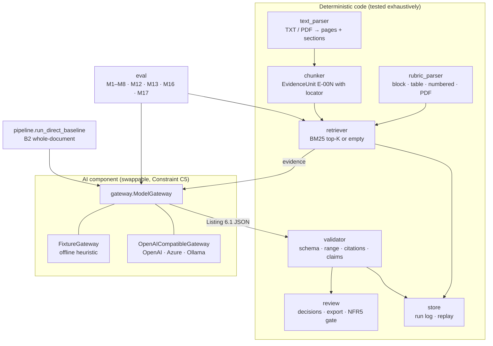

# Architecture

This follows the Lab 2 practice of separating the *AI component* from the
deterministic software around it, and the Lab 6 rule that a connection to a
model is not permission to trust its output.

## 1. Context

The final grade is never produced by the system (Constraint C1). The model sees
one criterion and at most K evidence units at a time; it never sees the full
submission, the student identity or other criteria (proposal §6.2).

## 2. Containers and modules

| Module | Responsibility | Proposal item |
|---|---|---|
| `schemas.py` | Pydantic contracts; `AssessmentDraft` = Listing 6.1 | §6.2 |
| `rubric_parser.py` | Ingest block / table / numbered / PDF rubrics, infer granularity, reject invalid levels | FR1–FR3, S7 |
| `text_parser.py`, `chunker.py` | TXT/PDF → pages with sections → evidence units with `p.X · section · ¶n` locator | FR4–FR5 |
| `retriever.py` | BM25 baseline; query = criterion name ×2 + top descriptors; returns top-K or `[]` | FR6, §6.4 |
| `gateway.py` | Only place a model is called. Fixture for tests; OpenAI-compatible client with env config; strict JSON parse; fail-closed | FR9–FR10, C5, NFR6 |
| `validator.py` | Unknown IDs, range, granularity, uncited positive claims, malformed output → warning + downgrade | FR11, S6 |
| `review.py` | Accept / edit / reject, marker values override AI values, export JSON+CSV, blocked while pending | FR12, FR13, FR15, NFR5 |
| `store.py` | Append-only JSONL run log; `replay_entry` re-executes from the log | FR16, NFR7, M12 |
| `pipeline.py` | Agent path and B2 baseline | §6.1, §8.2 |
| `eval.py` | Metrics, per-scenario table, Markdown report | §8.3–8.5 |
| `app/streamlit_app.py` | Marker UI, no prompt writing | FR7, NFR4 |

## 3. Data flow for one criterion

1. `retriever.retrieve(criterion, k)` → `[EvidenceUnit]` (may be empty → explicit "no relevant evidence").
2. `gateway.assess(criterion, evidence)` → `AssessmentDraft`. The prompt (`prompts/assessment_v1.md`) is versioned and its name is written to the run log.
3. `validator.validate_assessment(draft, criterion, evidence)`:
   * cited IDs ⊆ retrieved IDs, score ∈ [0, max] on the granularity grid,
   * every positive sentence in the explanation carries `[E-00N]`,
   * gateway flags `invalid_model_output` / `provider_error` become warnings.
   Any critical warning → `insufficient`, `provisional_score = null`, `validation_failed` flag.
4. `RunLogEntry` written (model id, prompt version, K, method, query, evidence IDs, outputs, latency).
5. Marker sees explanation, cited and uncited evidence with adjacent context, decides; export refused until all criteria decided.

## 4. Failure handling (Lab 6 "check the result")

| Failure | Where caught | What the marker sees |
|---|---|---|
| Model returns prose / bad JSON | `gateway.parse_model_json` | `insufficient`, warning `invalid_model_output` |
| HTTP error, timeout, no key | `OpenAICompatibleGateway.assess` | `insufficient`, warning `provider_error` |
| Model cites `E-999` | validator | warning `unknown_evidence_ids`, no score |
| Score 6/4 | validator | warning `score_out_of_range`, no score |
| Claim without citation | validator | warning `uncited_claim:n`, no score |
| PDF has no text layer | `text_parser` | `SubmissionParseError` surfaced in UI (OCR is out of scope, C4) |

## 5. What is deliberately not here

* No LMS or student-record integration (C2).
* No OCR / image / handwriting (C4).
* No autonomous grade submission (C1) — there is no code path that writes a grade anywhere.
* No embedding re-ranker yet; it is added only if Recall@K on the labelled set improves (§6.4, de-scoping order §10.3).
