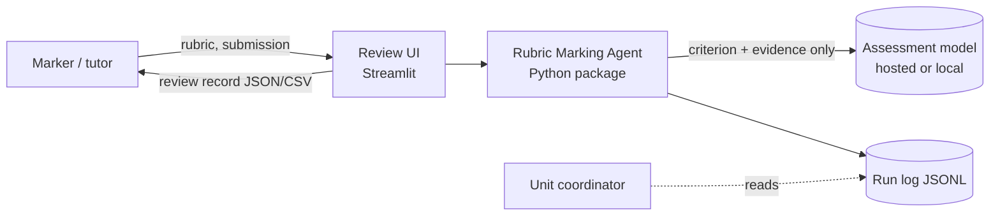
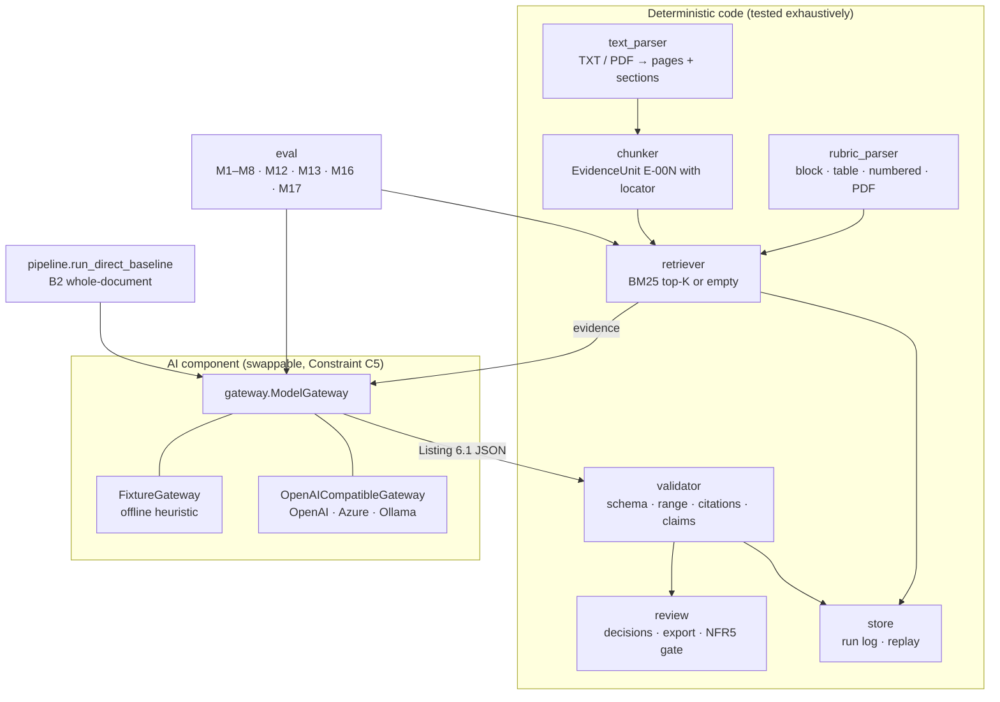

# Architecture

This follows the Lab 2 practice of separating the *AI component* from the
deterministic software around it, and the Lab 6 rule that a connection to a
model is not permission to trust its output.

## 1. Context

The final grade is never produced by the system (Constraint C1). The model sees
one criterion and at most K evidence units at a time; it never sees the full
submission, the student identity or other criteria (proposal §6.2).

## 2. Containers and modules

| Module | Responsibility | Proposal item |
|---|---|---|
| `schemas.py` | Pydantic contracts; `AssessmentDraft` = Listing 6.1 | §6.2 |
| `rubric_parser.py` | Ingest block / table / numbered / PDF rubrics, infer granularity, reject invalid levels | FR1–FR3, S7 |
| `text_parser.py`, `chunker.py` | TXT/PDF → pages, line structure kept; headings detected (`#`, `2.1 Title`, ALL CAPS) so PDF text gets real section names; paragraphs grouped to ~160 words, over-long PDF paragraphs split on sentences; evidence units with `p.X · section · ¶n` locator | FR4–FR5 |
| `retriever.py` | BM25 baseline; query = criterion name ×2 + top descriptors; returns top-K or `[]` | FR6, §6.4 |
| `gateway.py` | Only place a model is called. Fixture for tests; OpenAI-compatible client (hosted / Azure via env, local Ollama via `ollama:<model>`); strict JSON parse; one JSON-repair retry; `revise()` for one validator-driven corrective round; fail-closed | FR9–FR10, C5, NFR6 |
| `validator.py` | Unknown IDs, range, granularity, uncited positive claims, malformed output → warning + downgrade | FR11, S6 |
| `review.py` | Accept / edit / reject, marker values override AI values, export JSON+CSV, blocked while pending; session summary (duration, overrides, interventions) for M10/M11 | FR12, FR13, FR15, NFR5 |
| `store.py` | Append-only JSONL run log; `replay_entry` re-executes from the log with the gateway that produced the entry | FR16, NFR7, M12 |
| `pipeline.py` | Agent path (retrieve → assess → validate → optional revise → validate) and B2 baseline | §6.1, §8.2 |
| `eval.py` | Metrics, per-scenario table, revision statistics, Markdown report | §8.3–8.5 |
| `app/streamlit_app.py`, `app/pages/` | Marker UI (no prompt writing, B2 side-by-side), Evaluation dashboard, Run-log viewer + replay | FR7, NFR4 |

## 3. Data flow for one criterion

1. `retriever.retrieve(criterion, k)` → `[EvidenceUnit]` (may be empty → explicit "no relevant evidence").
2. `gateway.assess(criterion, evidence)` → `AssessmentDraft`. The prompt (`prompts/assessment_v2.md`) is versioned and its name is written to the run log. If the reply is not valid JSON for Listing 6.1 the gateway asks once more with the parse error attached.
3. `validator.validate_assessment(draft, criterion, evidence)`:
   * cited IDs ⊆ retrieved IDs, score ∈ [0, max] on the granularity grid,
   * every sentence that asserts something about the submission carries `[E-00N]` (variants such as `[E-001, E-002]` or `[E-001: "quote"]` are recognised; the IDs are still checked),
   * gateway flags `invalid_model_output` / `provider_error` become warnings.
   Any critical warning → `insufficient`, `provisional_score = null`, `validation_failed` flag.
4. **One corrective round.** If the record was rejected, the pipeline calls `gateway.revise(criterion, evidence, draft, warnings)`: the model sees its own answer and the validator's findings and answers again. The revision is validated exactly like the first answer and carries the flag `revised_once`; both attempts are in the run log (`attempts`, `first_attempt_warnings`). The fixture cannot revise, so this path only runs with a live model. There is no second round: if the model breaks a rule twice the record stays `insufficient` with no score.
5. `RunLogEntry` written (model id, prompt version, K, method, query, evidence IDs, outputs, attempts, latency).
6. Marker sees explanation, cited and uncited evidence with adjacent context, decides; export refused until all criteria decided.

## 4. Failure handling (Lab 6 "check the result")

| Failure | Where caught | What the marker sees |
|---|---|---|
| Model returns prose / bad JSON | `gateway.parse_model_json` | `insufficient`, warning `invalid_model_output` |
| HTTP error, timeout, no key | `OpenAICompatibleGateway.assess` | `insufficient`, warning `provider_error` |
| Model cites `E-999` | validator | warning `unknown_evidence_ids`, no score |
| Score 6/4 | validator | warning `score_out_of_range`, no score |
| Claim without citation | validator | warning `uncited_claim:n`, no score — unless the corrective round fixes it, then `revised_once` |
| Model breaks a rule twice | pipeline | first attempt's warnings in the log, final record `insufficient`, no score |
| PDF has no text layer | `text_parser` | `SubmissionParseError` surfaced in UI (OCR is out of scope, C4) |
| Document longer than the model context (B2 only) | `render_direct_prompt` | text truncated at 48k characters with a marker; the agent path is unaffected because it never sends the whole document |

## 5. What is deliberately not here

* No LMS or student-record integration (C2).
* No OCR / image / handwriting (C4).
* No autonomous grade submission (C1) — there is no code path that writes a grade anywhere.
* No embedding re-ranker yet; it is added only if Recall@K on the labelled set improves (§6.4, de-scoping order §10.3).
